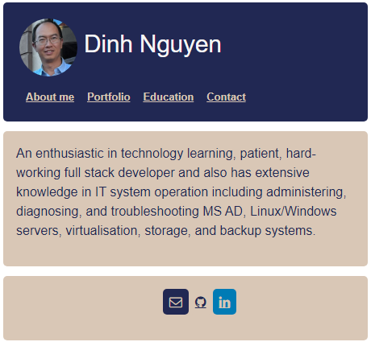
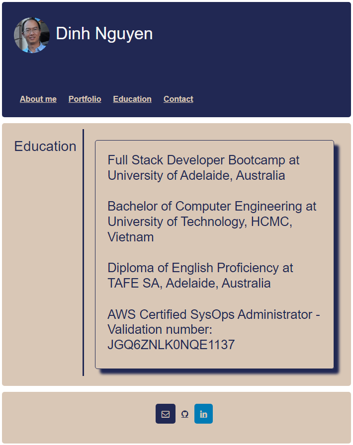
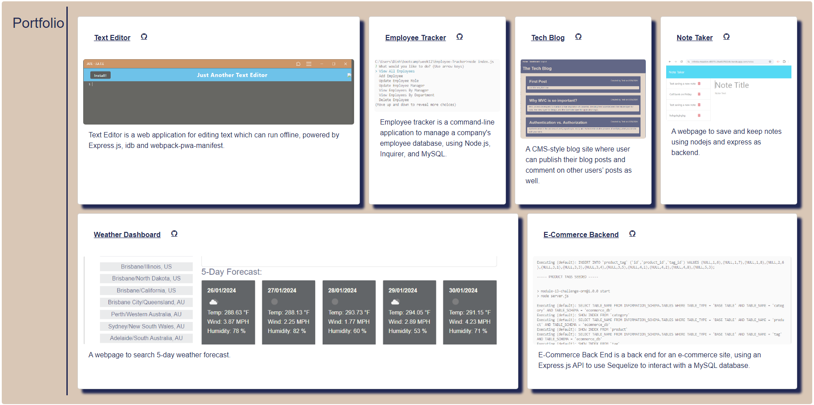

# Portfolio

## Description

Portfolio is a webpage to show the projects, which is used React to develop.

It is powered by

- [@vitejs/plugin-react](https://github.com/vitejs/vite-plugin-react/blob/main/packages/plugin-react/README.md) uses [Babel](https://babeljs.io/) for Fast Refresh
- [@vitejs/plugin-react-swc](https://github.com/vitejs/vite-plugin-react-swc) uses [SWC](https://swc.rs/) for Fast Refresh

## Installation

The app is hosted on [https://dinh-nguyen.netlify.app/](https://dinh-nguyen.netlify.app/)
Follow the below steps to install on local computer.

- Step 1: clone project to your local computer.
- Step 2: navigate to "Portfolio" folder.
- Step 3: run "npm install" to install the required modules.
- Step 4: run "npm run build" to build the project.
- Step 4: run "npm start" to run a local webpage at http://localhost:3000

## Usage

- To change the information of projects, go to src/utils/API.js and change the content.
- To change the AboutMe page, go to src/pages/AboutMe.jsx.
- To change the education page, go to src/pages/Education.jsx.
- To change the information of footer, go to src/components/Footer.jsx.
- To change the information of header such as name and avatar, go to src/components/Header.jsx.

## Credits

Website powered by [@vitejs/plugin-react](https://github.com/vitejs/vite-plugin-react/blob/main/packages/plugin-react/README.md) uses [Babel](https://babeljs.io/) for Fast Refresh, [@vitejs/plugin-react-swc](https://github.com/vitejs/vite-plugin-react-swc) uses [SWC](https://swc.rs/) for Fast Refresh, [bootstrap](https://www.npmjs.com/package/bootstrap), [react](https://www.npmjs.com/package/react), [react-dom](https://www.npmjs.com/package/react-dom), [react-hook-form](https://www.npmjs.com/package/react-hook-form), [react-router-dom](https://www.npmjs.com/package/react-router-dom).
